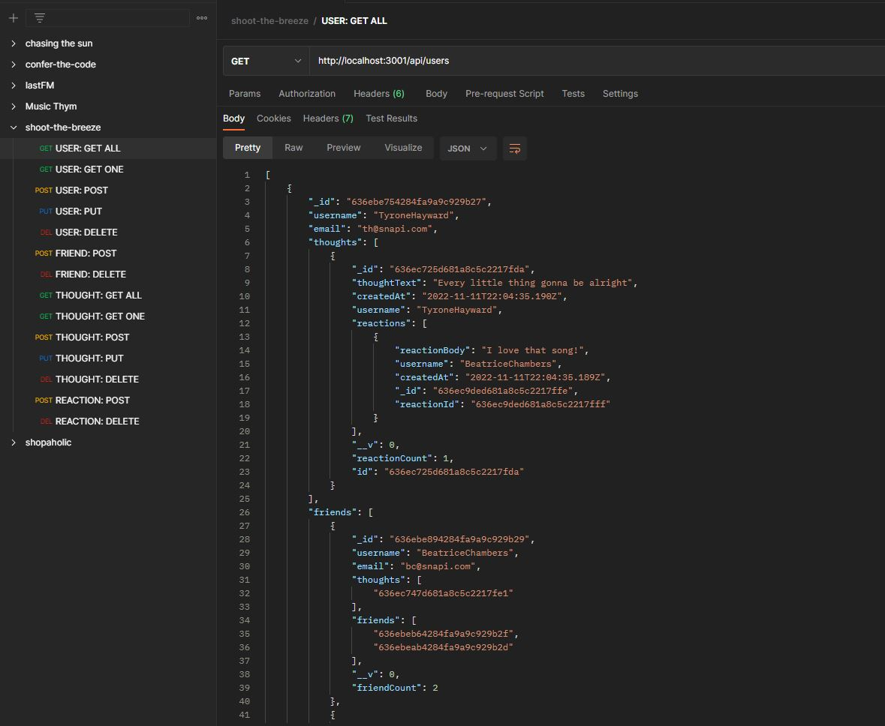
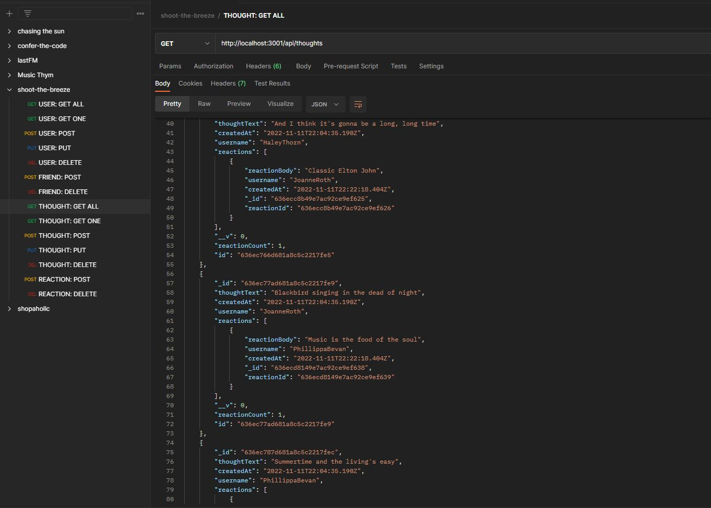

# Shoot the Breeze: A Social Network API
Finding associated data has never been easier with this back-end sample API that mimicks popular social media platforms.

## Table of Contents

- [Description](#description)
- [Deployed Application](#deployed-application)
- [Future Improvements](#future-improvements)
- [Usage](#usage)
- [Credits](#credits)
- [License](#license)

## Description

This app reflects the back-end side of social media apps: Users can create a friend list, add their thoughts and have reactions to others' thoughts in a NOSQL database using Express and mongoose ODM. Demonstrated with MongoDB Compass and Postman.

## Deployed Application

This challenge does not include a deployed application. Instead, a screen-recorded video is submitted alongside the github repo link.

Video link: 

## Future Improvements

* Understand how to delete a user's associated data (like thoughts) when deleting an entire user. MongoDB does not have a SQL equivalent to ON DELETE CASCADE, which would be really handy here. Something to look into for the future.
* Instead of seeding Postman manually, debug/refactor the js files in the seeds folder to randomly seed any number of users the developer wishes.

## Usage

Below are screenshots of Shoot the Breeze: A Social Network API

## Credits

Collaborators:

Firmin Saint-Amour (Instructor)

List of resources used:

https://mongoosejs.com/docs/guide.html

https://mongoosejs.com/docs/schematypes.html

https://mongoosejs.com/docs/validation.html#built-in-validators

https://www.name-generator.org.uk/quick/

https://nodejs.org/api/process.html#event-exit

https://www.geeksforgeeks.org/node-js-process-exit-method/

https://www.mongodb.com/docs/manual/reference/method/db.collection.deleteMany/

https://expressjs.com/en/guide/routing.html

https://developer.mozilla.org/en-US/docs/Web/JavaScript/Reference/Operators/Spread_syntax#spread_in_object_literals

https://mongoosejs.com/docs/populate.html

https://www.mongodb.com/community/forums/t/how-to-delete-a-specific-nested-subdocument-completely-from-an-document/100219/3

## License

No licenses (default copyright laws apply).

---